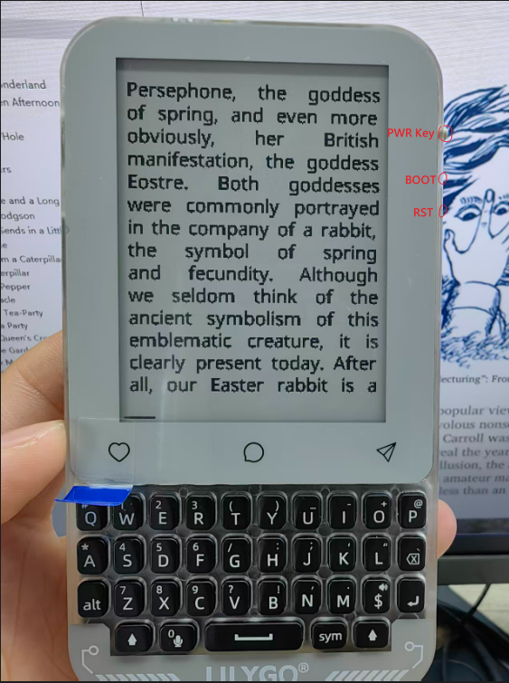

# T-Deck-Max CrossPoint Port

`English` | [中文](./README_CN.md)

## 1. Thanks and Project Changes

First, thanks to the authors and contributors of the [CrossPoint Reader](https://github.com/crosspoint-reader/crosspoint-reader) open-source project.
This project provides a complete, readable, and extensible open-source firmware foundation for e-paper readers, and makes it practical to port the software to other hardware platforms.

This repository follows the CrossPoint design approach and reader architecture, and has been adapted and extended for **LilyGO T-Deck-Max**. The main completed changes include:

- Porting the original firmware from the Xteink X4 target to the **T-Deck-Max / ESP32-S3** platform.
- Adapting the firmware for the T-Deck-Max **240 x 320 e-paper display**, keyboard matrix, power management, charging, and battery monitoring.
- Rebuilding the input layer so the physical keyboard maps to the logical reader buttons: `Back / Confirm / Left / Right / Up / Down / Power`.
- Adding and improving **keyboard mapping settings**, allowing key customization in `Settings -> Controls -> Keyboard Mapping`.
- Adding a **Battery Status** page to inspect battery, charging, and power-related information.
- Adapting the UI, lists, reader layout, and themes for the smaller T-Deck-Max display.
- Preserving and adapting the original CrossPoint reading features, including **EPUB / TXT / XTC** reading, caching, progress saving, screen rotation, and status bar configuration.

Note:
This repository is now a **T-Deck-Max-specific build** and is no longer intended to remain compatible with the original X4 hardware.

## 2. T-Deck-Max Hardware Overview

The current port mainly uses the following hardware:

T-Deck-Max upstream repository: [github](https://github.com/Xinyuan-LilyGO/T-Deck-MAX)

CrossPoint firmware downloads: [./firmware](./firmware/README.md)

## 3. Basic Usage

### 3.1 Power and Home Screen

- Long-press `BOOT` to power off, and long-press `PWR` to power on.
- After boot, the device enters the `Home` screen by default.
- From the home screen, you can access file browsing, recent books, file transfer, settings, and other features.

### 3.2 Importing Books

There are two common ways to add books:

- Copy book files into storage and open them from `Browse Files`.
- Upload books through the Wi-Fi file transfer page.

The current firmware mainly targets these formats:

- `EPUB`
- `TXT`
- `XTC`

### 3.3 Settings Entry Points

Main settings categories:

- `Settings -> Display`
- `Settings -> Reader`
- `Settings -> Controls`
- `Settings -> System`

The settings most closely related to T-Deck-Max include:

- `Settings -> Controls -> Keyboard Mapping`
- `Settings -> Controls -> Battery Status`
- `Settings -> Reader -> Customise Status Bar`

## 4. Default Key Mapping

The current default logical key mapping is:

| Logical Function | T-Deck-Max Default Key |
| --- | --- |
| Back | `Del` |
| Confirm | `Enter` |
| Left | `A` |
| Right | `D` |
| Up | `W` |
| Down | `S` |
| Power | `BOOT` |

On most menu pages:

- `W` or `A`: previous / up
- `S` or `D`: next / down
- `Enter`: confirm / open
- `Del`: back

Notes:

- By default, the reader page also uses `W / S` as page-turn logic keys.
- If you do not like the default layout, you can rebind it in `Settings -> Controls -> Keyboard Mapping`.

## 5. Reading Page Operations

Operations differ slightly depending on the document format.

### 5.1 EPUB Reader Page

Basic operations:

- `A`: previous page
- `D`: next page
- `W`: previous page
- `S`: next page
- Short press `Del`: return to the home screen
- Long press `Del` for about 1 second: return to the file browser
- Press `Enter`: open the reader menu

If `Settings -> Controls -> Long Press Skip` is enabled:

- Hold a page-turn key and release it to jump directly to the previous or next chapter

The EPUB reader menu includes:

- Chapter selection
- Footnotes list
- Go to percentage
- Auto page turn
- Screen orientation switching
- Screenshot
- Display current page text as a QR code
- Return home
- KOReader Sync progress sync
- Delete this book's cache

Additional notes:

- If the current page comes from a footnote jump, short-pressing `Del` first returns to the original reading position.
- The global screenshot shortcut is `BOOT + S`.

### 5.2 TXT Reader Page

Basic operations:

- `A`: previous page
- `D`: next page
- `W`: previous page
- `S`: next page
- Short press `Del`: return to the home screen
- Long press `Del` for about 1 second: return to the file browser

The TXT reader is currently focused on sequential plain-text reading and does not provide the full EPUB-style menu flow.

### 5.3 XTC Reader Page

Basic operations:

- `A`: previous page
- `D`: next page
- `W`: previous page
- `S`: next page
- Short press `Del`: return to the home screen
- Long press `Del` for about 1 second: return to the file browser
- Press `Enter`: open chapter selection

If `Settings -> Controls -> Long Press Skip` is enabled:

- Long-holding a page-turn key can move by a larger step size

### 5.4 Power-Key Related Behavior

The `BOOT` key is both the hardware power key and the logical `Power` key.

- Long press can power the device off
- In system settings, short-press power behavior can be configured as:
  - Ignore
  - Page turn in reader
  - Force refresh

## 6. Usage Tips

- The first time you open a large EPUB, the system builds cache files. This is expected.
- If reading layout or pagination looks wrong, try deleting the reading cache and reopening the book.
- If you want to customize the control experience, start with:
  - `Keyboard Mapping`
  - `Short Power Button`
  - `Long Press Skip`
  - `Customise Status Bar`

---

