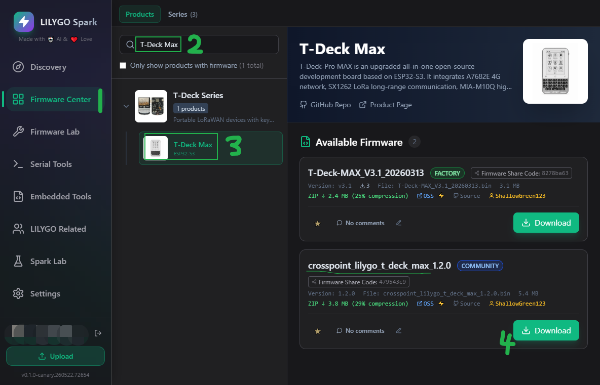
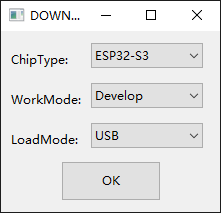
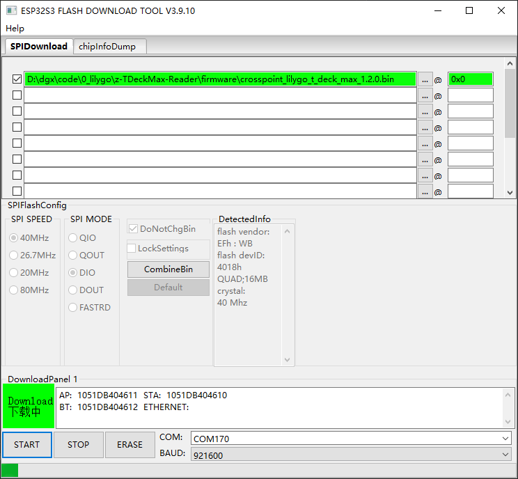

# Firmware Update / 固件更新

## 中文

### 使用 LILYGO Spark 更新（推荐）

1. 下载 [LILYGO Spark](https://lilygo.cc/en-us/pages/lilygo-sparksrsltid=AfmBOoorTB7ptFu2LQNLRnoI2SA0zBGJTN6JpI9J3hmHEkKhBQSmeu0Y) 工具。
2. 在 LILYGO Spark 中搜索 `T-Deck MAX`，下载 `crosspoint_lilygo_t_deck_max_xxxx.bin` 文件。
3. 按工具提示完成烧录；如果设备没有自动重启，按一下复位键即可启动。

### 使用 flash_download_tools 更新

1. 下载 [flash_download_tools](https://docs.espressif.com/projects/esp-test-tools/zh_CN/latest/esp32/production_stage/tools/flash_download_tool.html) 工具。
2. 下载 `firmware/` 目录中的固件文件到本地，然后按下图所示在 `flash_download_tools` 中加载并烧录。
3. 烧录完成后，按一下复位键启动设备。

## English

### Update with LILYGO Spark (Recommended)

1. Download [LILYGO Spark](https://lilygo.cc/en-us/pages/lilygo-sparksrsltid=AfmBOoorTB7ptFu2LQNLRnoI2SA0zBGJTN6JpI9J3hmHEkKhBQSmeu0Y).
2. Search for `T-Deck MAX` in LILYGO Spark and download the `crosspoint_lilygo_t_deck_max_xxxx.bin` firmware package.
3. Flash the firmware through the tool. If the device does not reboot automatically, press the reset button once.

### Update with flash_download_tools

1. Download [flash_download_tools](https://docs.espressif.com/projects/esp-test-tools/en/latest/esp32/production_stage/tools/flash_download_tool.html).
2. Download the firmware file from this `firmware/` directory, then load it in `flash_download_tools` as shown below.
3. After flashing finishes, press the reset button once to boot the device.

